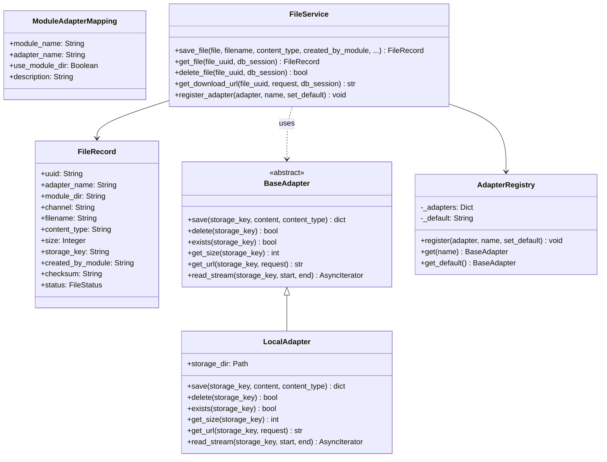
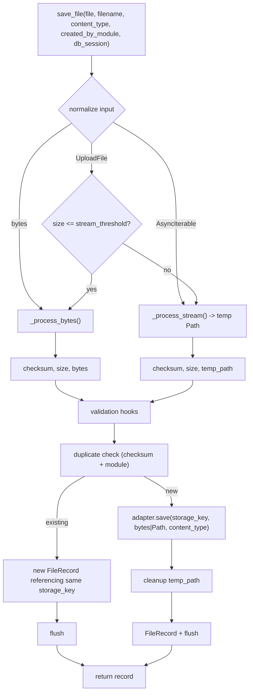
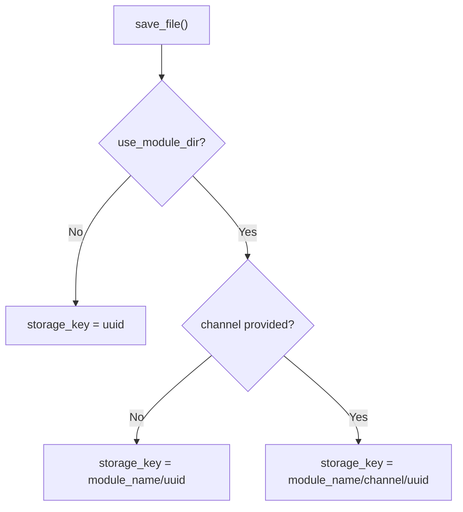

# ChaccFileManager Module

The adapter-based file management for ChaCC API. Files are addressed by UUID, stored through pluggable adapters, and tracked in the database with deduplication, validation hooks, and configurable streaming behavior.

## What This Module Does

- Accepts uploads from any module via a single unified `save_file(file, ...)` API
- Stores metadata in `file_records` and delegates bytes/paths to adapters
- Serves files with range-request support and cache-friendly headers
- Lets administrators route modules to different adapters at runtime

## Architecture



## Save Pipeline



## Quick Start

```python
from .context_factory import get_module_context

file_service = get_module_context().get_service("file_service")

record = await file_service.save_file(
    file=upload_file,          # UploadFile | bytes | AsyncIterable[bytes]
    filename="photo.jpg",
    content_type="image/jpeg",
    created_by_module="menu",  # identifies which ChaCC module owns the file
    created_by_user_id=current_user.id,  # Optional: track ownership per user
    channel="images",          # optional, only used if module mapping sets use_module_dir=true
    db_session=db,
)
```

`created_by_module` identifies which ChaCC module owns the file. This is used for deduplication (files are deduplicated per module), adapter routing (modules can be mapped to different storage backends), and storage organization (module directories). It is not a user ID—use `created_by_user_id` for user-level ownership.

## Serving Files

Once a file is uploaded, its content can be served directly via the built-in endpoint:

```http
GET /files/019f45a2-35fa-7682-ba04-3c2c5e1d1163/content
```

The endpoint handles:
- `Content-Disposition: inline` by default (for ``, `<video>` tags)
- `?download=1` forces `Content-Disposition: attachment` (download prompt)
- `Range` headers for partial content (video seeking, resumable downloads)
- `ETag` and `Cache-Control` headers (configurable cache TTL, revalidated via `ETag`)

No custom route is needed. The file manager provides this endpoint automatically.

## Installation

As a ChaCC module, the file manager is installed like any other plugin:

```bash
chacc add chacc-file-manager
```

Or if building from source:

```bash
chacc build chacc-file-manager.chacc
```

After installation, the file service is available via:
```python
file_service = get_module_context().get_service("file_service")
```

The module requires `aiofiles`, `uuid_utils`, `sqlalchemy`, and `fastapi`. These will be installed automatically when you add the module via `chacc add`.

## Unified `file` Parameter

`save_file()` accepts **one** `file` parameter with three shapes:

| Shape | Behavior |
|-------|----------|
| `UploadFile` | If `size <= STREAM_THRESHOLD`, reads into memory. Otherwise streams chunks from the upload. |
| `bytes` | Fast path — no temp file, direct checksum + adapter write. |
| `AsyncIterable[bytes]` | Streamed path — written to a service-managed temp file for checksumming, then passed to the adapter as a `Path`. |

## Validation Hooks

Optional async hooks run **before** duplicate checking and before `adapter.save()`. They receive:
- `payload`: `bytes` for small files, `Path` for streamed files
- `metadata`: always `{}` at this stage (adapter has not run yet)
- `is_path`: `True` if `payload` is a `Path`

The metadata returned by `adapter.save()` is passed to validation hooks (as the `metadata` parameter) and stored in the `FileRecord` table. You can use it to store backend-specific information like S3 keys, CDN URLs, or custom file IDs.

Hooks should not rely on `metadata` at this stage because `adapter.save()` has not executed yet.

```python
import io
from PIL import Image

async def require_image_dimensions(payload, metadata, is_path):
    if is_path:
        # Read the file asynchronously
        async with aiofiles.open(payload, "rb") as f:
            data = await f.read()
    else:
        data = payload
    
    image = Image.open(io.BytesIO(data))
    if image.width < 800 or image.height < 600:
        raise ValueError("Image too small")
```

## Error Handling

`save_file()` raises the following exceptions:

- `FileTooLargeError` — File exceeds `MAX_FILE_SIZE`.
- `InvalidContentTypeError` — Content type not in `ALLOWED_CONTENT_TYPES`.
- `ValueError` — `db_session` is `None`.
- `TypeError` — Stream yields non-bytes chunks.
- Any exception raised by validation hooks (wrapped in `await hook(...)`).

**Module developers should catch exceptions at the route layer and return appropriate HTTP responses.**

## Deduplication

If a file with the same `checksum` already exists for the same `created_by_module`, the service:
1. Skips writing to the adapter
2. Creates a **new** `FileRecord` with a fresh UUID
3. Reuses the existing `storage_key`
4. Flushes both records in the same transaction

This means identical uploads share storage, but every caller gets its own DB row with its own UUID and metadata.

## Transaction Model

- **Service layer**: `db_session.add(record)` + `db_session.flush()` + `db_session.refresh(record)`
- **Route layer**: owns `db_session.commit()`

This keeps the service testable without implicit commits and avoids nested savepoints.

## Adapter Contract

An adapter is any object implementing these methods. It does **not** need to inherit from a specific class.

| Method | Signature | Returns | Notes |
|--------|-----------|---------|-------|
| `save` | `(storage_key: str, content: Union[bytes, Path], content_type: str) -> dict` | `dict` | Returns adapter metadata. `storage_key` is built by the service from UUID + optional module/channel paths. |
| `delete` | `(storage_key: str) -> bool` | `bool` | `True` if successful. |
| `exists` | `(storage_key: str) -> bool` | `bool` | |
| `get_size` | `(storage_key: str) -> int` | `int` | Size in bytes. |
| `get_url` | `(storage_key: str, request: Request) -> str` | `str` | Client-facing URL. |
| `read_stream` | `(storage_key: str, start: int = 0, end: Optional[int] = None) -> AsyncIterator[bytes]` | async iterator | Must support byte ranges for 206 Partial Content. |
| `health_check` | `() -> bool` | `bool` | Default implementation returns `True`. |

**Rules**
- `file_uuid` and `storage_key` are opaque identifiers. Do not treat them as filesystem paths unless your adapter needs to.
- `content` is either `bytes` (small files) or a `Path` to a temp file (streamed files). Your adapter is responsible for handling both.
- `read_stream` must honor `start` and `end`. If your backend cannot seek, read the full content and slice it in memory.

## Storage Layout

The `storage_key` passed to your adapter is built as follows:



Examples:
- Flat: `019f45a2-35fa-7682-ba04-3c2c5e1d1163`
- Module dir: `menu/019f45a2-35fa-7682-ba04-3c2c5e1d1163`
- Module + channel: `menu/images/019f45a2-35fa-7682-ba04-3c2c5e1d1163`

## Development Stub

Copy this into your module for IDE support. It is not imported at runtime.

```python
class BaseAdapter:
    name: str = "base"

    async def save(self, storage_key: str, content, content_type: str) -> dict:
        raise NotImplementedError

    async def delete(self, storage_key: str) -> bool:
        raise NotImplementedError

    async def exists(self, storage_key: str) -> bool:
        raise NotImplementedError

    async def get_size(self, storage_key: str) -> int:
        raise NotImplementedError

    async def get_url(self, storage_key: str, request) -> str: # request is unused but required by contrac
        raise NotImplementedError

    async def read_stream(self, storage_key: str, start: int = 0, end=None):
        raise NotImplementedError

    async def health_check(self) -> bool:
        return True
```

At runtime, fetch the actual class from the backbone context to validate adapters structurally:

```python
from typing import cast
_base_adapter_class = get_module_context().get_service("base_adapter")
BaseAdapter = cast(type[BaseAdapter], _base_adapter_class)
```

## Example: S3 Adapter

```python
import asyncio
from pathlib import Path

class S3Adapter(BaseAdapter):
    name = "s3"

    def __init__(self, bucket, client):
        self.bucket = bucket
        self.client = client

    async def save(self, storage_key, content, content_type):
        key = f"uploads/{storage_key}"
        loop = asyncio.get_running_loop()
        if isinstance(content, Path):
            await loop.run_in_executor(None, self.client.upload_from_path, self.bucket, key, str(content))
        else:
            await loop.run_in_executor(None, self.client.upload_bytes, self.bucket, key, content, content_type)

    async def delete(self, storage_key):
        await self.client.delete(self.bucket, f"uploads/{storage_key}")
        return True

    async def exists(self, storage_key):
        return await self.client.exists(self.bucket, f"uploads/{storage_key}")

    async def get_size(self, storage_key):
        return await self.client.size(self.bucket, f"uploads/{storage_key}")

    async def get_url(self, storage_key, request):
        return await self.client.presigned_url(self.bucket, f"uploads/{storage_key}")

    async def read_stream(self, storage_key, start=0, end=None):
        key = f"uploads/{storage_key}"
        return self.client.stream(self.bucket, key, start=start, end=end)

    async def health_check(self):
        return await self.client.ping(self.bucket)
```

## Configuration

Configuration is read via `BackboneContext.get_module_config()` from `.env`. All variables are prefixed with `CHACC_FILE_MANAGER_`.

```bash
# .env
CHACC_FILE_MANAGER_STORAGE_DIR=/var/lib/app/uploads
CHACC_FILE_MANAGER_MAX_FILE_SIZE=52428800
CHACC_FILE_MANAGER_STREAM_THRESHOLD=10485760
CHACC_FILE_MANAGER_UPLOAD_CHUNK_SIZE=65536
CHACC_FILE_MANAGER_ALLOWED_CONTENT_TYPES=image/jpeg,image/png,application/pdf
CHACC_FILE_MANAGER_FILE_CACHE_MAX_AGE=300
```

| Variable | Default | Description |
|----------|---------|-------------|
| `STORAGE_DIR` | `/tmp/chacc_file_storage` | Base directory for the local adapter. |
| `MAX_FILE_SIZE` | `10485760` | Maximum upload size in bytes (10 MB). |
| `STREAM_THRESHOLD` | `10485760` | Files larger than this are streamed to a temp file instead of loaded into memory (10 MB). |
| `UPLOAD_CHUNK_SIZE` | `8192` | Bytes to read per chunk when streaming from `UploadFile`. |
| `ALLOWED_CONTENT_TYPES` | `""` (allow all) | Comma-separated MIME types allowed. Empty means no restriction. |
| `FILE_CACHE_MAX_AGE` | `300` | `Cache-Control` `max-age` (seconds) for served files. `immutable` is intentionally omitted so clients revalidate via `ETag` — deletions take effect on next revalidation. Set to `0` to effectively disable caching. |

### Determining the right thresholds

- Set `STREAM_THRESHOLD` to the maximum comfortable in-memory size for your deployment.
- Set `MAX_FILE_SIZE` to the absolute ceiling you want enforced at the service layer.
- `UPLOAD_CHUNK_SIZE` controls how aggressively the service drains the `UploadFile` stream. Larger values reduce coroutine overhead; smaller values reduce memory spikes during streaming.

## Module-to-Adapter Mapping

Administrators map modules to adapters via the management API:

```bash
POST /files/module-mappings
{
  "module_name": "menu",
  "adapter_name": "s3",
  "use_module_dir": true,
  "description": "Menu images stored in S3"
}
```

Resolution order:
1. Explicit `adapter_name` passed to `save_file()`
2. `ModuleAdapterMapping` for `created_by_module`
3. Default adapter (first registered, or explicitly set via `set_default=True`)

## API Endpoints

### File Operations

| Endpoint | Method | Auth | Description |
|----------|--------|------|-------------|
| `/files/` | POST | Admin/Module | Upload a file (`multipart/form-data` with `file` field, optional `channel`) |
| `/files/{uuid}/content` | GET | Public (no built-in auth) | Serve file content by UUID. If you need access control, implement it at the route layer. |
| `/files/{uuid}/content?download=1` | GET | Public | Download with `Content-Disposition: attachment` |
| `/files/{uuid}` | DELETE | Admin/Module | Soft-delete a file by UUID |

### Metadata Endpoints

| Endpoint | Method | Auth | Description |
|----------|--------|------|-------------|
| `/files/adapters` | GET | Admin | List all registered adapters |
| `/files/adapters/{name}` | GET | Admin | Get adapter info |
| `/files/module-mappings` | GET | Admin | List module-to-adapter mappings |
| `/files/module-mappings` | POST | Admin | Create module-to-adapter mapping |
| `/files/module-mappings/{module_name}` | DELETE | Admin | Delete module-to-adapter mapping |

## Response Headers

Successful file serves include:

```http
Content-Type: <file content_type>
Content-Disposition: inline; filename="photo.jpg"
Cache-Control: public, max-age=3600
ETag: "<sha256_checksum>"
Accept-Ranges: bytes  (only on range requests)
```

The `Cache-Control` `max-age` is controlled by `FILE_CACHE_MAX_AGE` (default `3600`). `immutable` is deliberately not sent so clients revalidate against the `ETag`; when a file is deleted the next revalidation returns `404` instead of a stale cached copy.

## Security

- Path traversal protection via `_get_storage_path()` path containment check
- Original filenames are sanitized before persistence
- Content-type allowlist enforced before reading body
- No filesystem paths exposed in API responses
- Adapter registration is structural, not import-based

## What You Should Not Do

- Do not import `BaseAdapter`, `AdapterRegistry`, or internal classes directly from this module's source
- Do not modify this module's code to support a new backend
- Do not store absolute filesystem paths in adapter metadata
- Do not assume `storage_key` is a path unless your adapter needs it to be

## Troubleshooting

**Adapter not being used:**
- `GET /files/module-mappings` — verify mapping exists
- `GET /files/adapters` — verify adapter is registered
- Check exact spelling of `adapter_name`

**Upload fails with "File too large":**
- Check `MAX_FILE_SIZE` in `.env`
- For chunked uploads, also check `STREAM_THRESHOLD` vs uploaded size

**Range requests return 416:**
- Adapter `read_stream` must honor `start` and `end`
- If backend does not support seeks, buffer and slice in memory

## Testing

```bash
pytest src/tests/ -v
```
