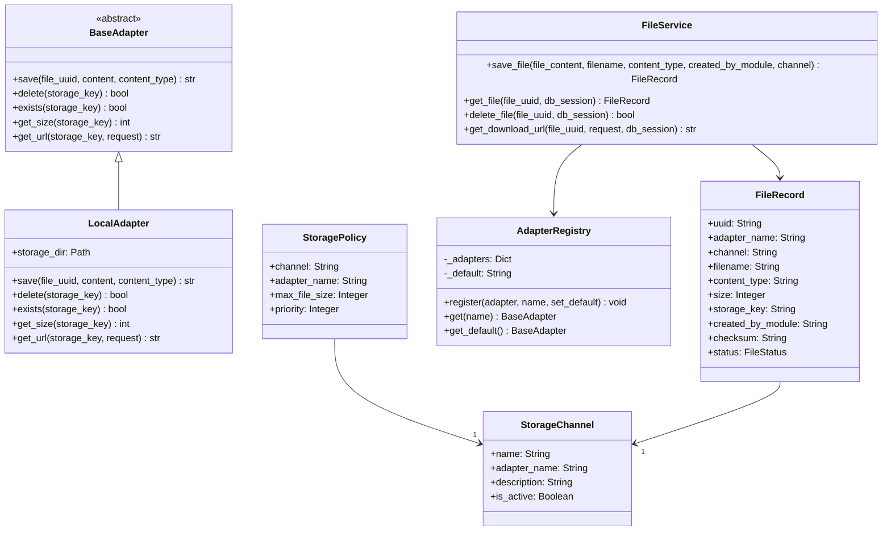
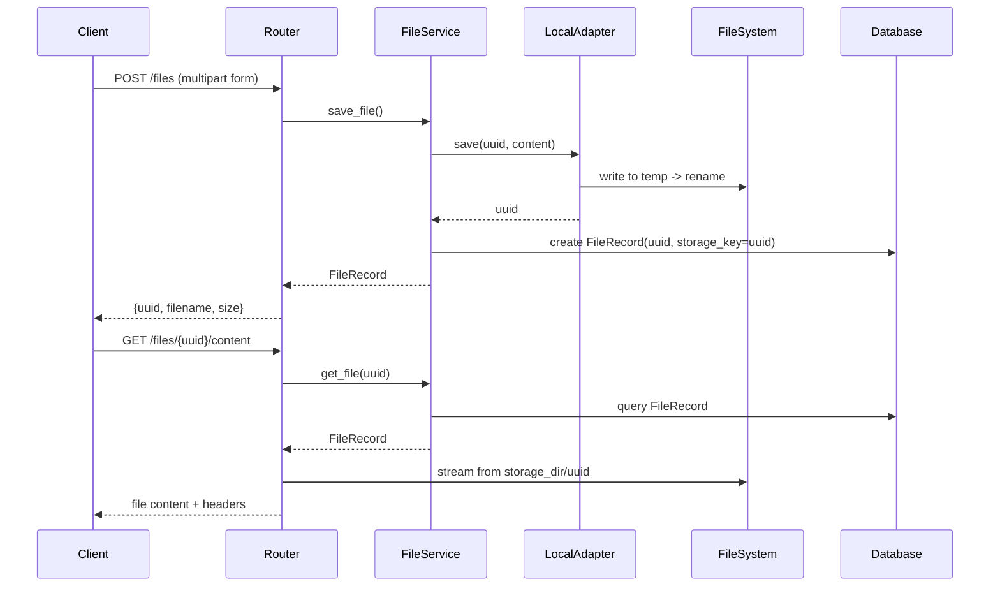

# ChaccFileManager Module

A ChaCC plugin module providing secure, UUID-addressed file management with local filesystem storage.

## Architecture



## Data Flow



## Design Choices

### UUID-Based Storage
- **Files are stored using their UUID as the filename** (stored in `storage_key`)
- Original `filename` is stored separately for download display only
- This ensures path obfuscation - users never know the actual file location

### Security Features
- Path traversal protection via `_get_storage_path()` validation
- Files stored in configured `STORAGE_DIR` with resolved paths
- No direct filesystem path exposure in API responses

### Streaming Performance
- Async file streaming using `aiofiles`
- Range request support (206 Partial Content) for all file types
- Streaming prevents loading entire files into memory

### Headers for HTML/Media Compatibility
- `Content-Disposition: inline` by default (for ``, `<video>` tags)
- `Cache-Control: public, max-age=31536000, immutable` for caching
- ETag based on SHA-256 checksum for integrity verification

## API Endpoints

| Endpoint | Method | Description |
|----------|--------|-------------|
| `/files/` | POST | Upload a file (multipart form with `file` field) |
| `/files/{uuid}/content` | GET | Serve file content by UUID |
| `/files/{uuid}/content?download=1` | GET | Download file with attachment disposition |
| `/files/{uuid}` | DELETE | Delete a file by UUID |
| `/files/health` | GET | Module health check |

## Configuration

Environment variables (prefixed with `CHACC_FILE_MANAGER_`):

| Variable | Type | Default | Description |
|----------|------|---------|-------------|
| `STORAGE_DIR` | string | `/uploads` | Base directory for file storage |
| `MAX_FILE_SIZE` | int | 10485760 | Maximum file size in bytes (10MB) |
| `DEFAULT_CHANNEL` | string | `default` | Default storage channel |

## File Lifecycle

```mermaid
flowchart TD
    A[POST /files] --> B[Generate UUID]
    B --> C[Compute SHA-256 checksum]
    C --> D[Save to storage/{uuid}]
    D --> E[Create DB record]
    E --> F[Return UUID to client]

    G[GET /files/{uuid}] --> H[Lookup FileRecord]
    H --> I[Stream file from storage/{storage_key}]
    I --> J[Return with headers]

    K[DELETE /files/{uuid}] --> L[Lookup FileRecord]
    L --> M[Delete from filesystem]
    M --> N[Delete DB record]
```

## Adapter Interface

To create a custom adapter (e.g., S3, GCS):

```python
from adapters.base import BaseAdapter

class S3Adapter(BaseAdapter):
    name = "s3"

    async def save(self, file_uuid: str, content: bytes, content_type: str) -> str:
        # Upload to S3, return storage key
        return s3_key

    async def delete(self, storage_key: str) -> bool:
        # Delete from S3
        return True

    async def exists(self, storage_key: str) -> bool:
        # Check S3 existence
        return True

    async def get_size(self, storage_key: str) -> int:
        # Get file size from S3
        return 1024

    async def get_url(self, storage_key: str, request) -> str:
        # Generate URL for the file
        return file_url
```

## Testing

```bash
# Run tests
pytest src/tests/ -v

# Or use the test runner
python src/run_tests.py
```

## Dependencies

- `aiofiles>=23.0.0` - Async file I/O
- `pydantic-settings>=2.0.0` - Configuration management