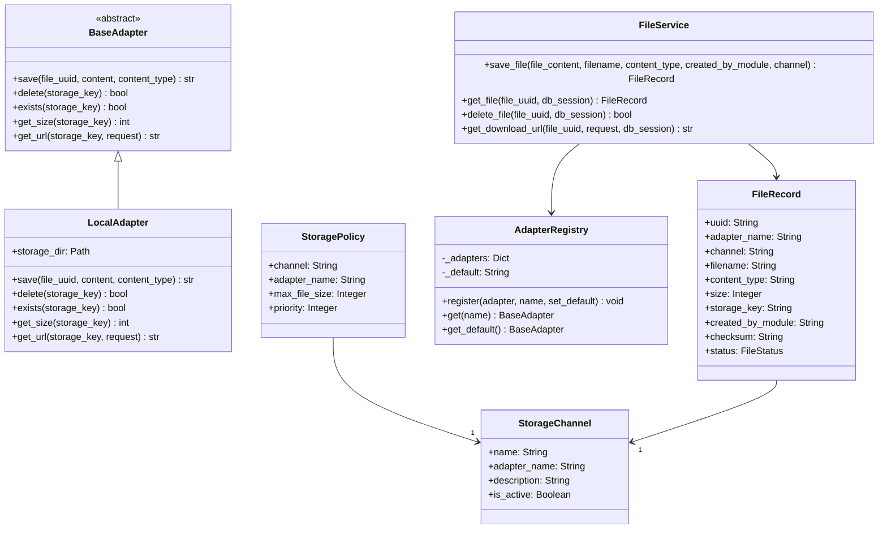
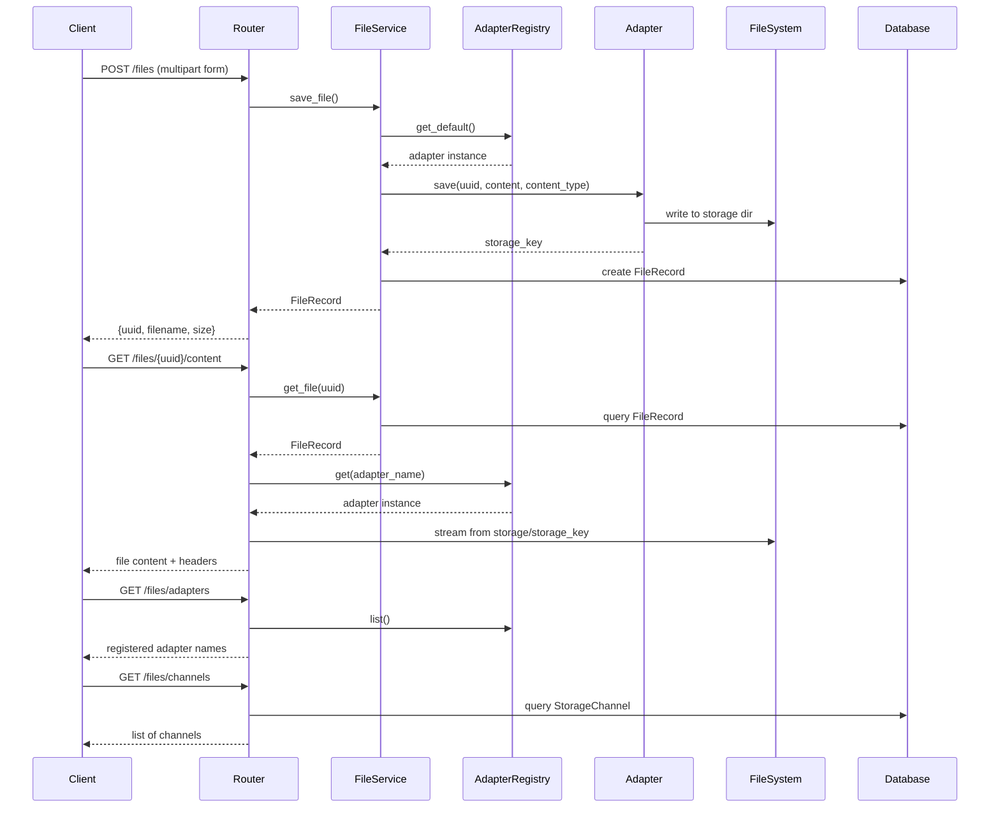
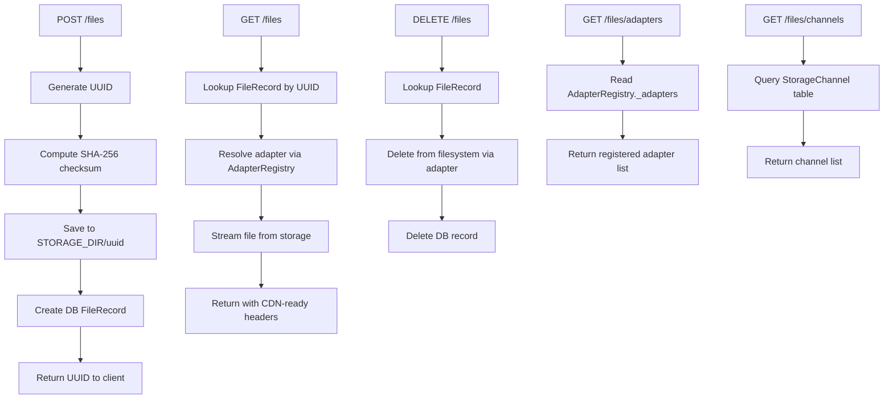
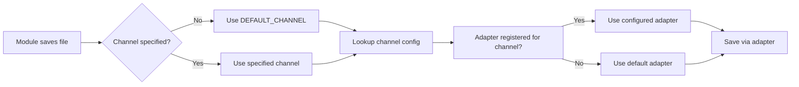
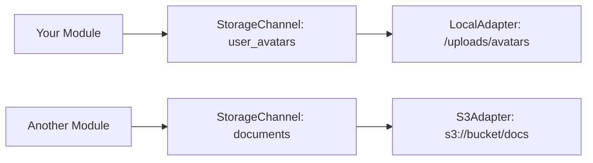

# ChaccFileManager Module

A ChaCC plugin module providing secure, UUID-addressed file management with local filesystem storage.

## Architecture



## Order of Events / Request Flow



## Design Choices

### UUID-Based Storage
- **Files are stored using their UUID as the filename** (stored in `storage_key`)
- Original `filename` is stored separately for download display only
- This ensures path obfuscation - users never know the actual file location

### Security Features
- Path traversal protection via `_get_storage_path()` validation
- Files stored in configured `STORAGE_DIR` with resolved paths
- No direct filesystem path exposure in API responses

### Streaming Performance
- Async file streaming using `aiofiles`
- Range request support (206 Partial Content) for all file types
- Streaming prevents loading entire files into memory

### Headers for HTML/Media Compatibility
- `Content-Disposition: inline` by default (for ``, `<video>` tags)
- `Cache-Control: public, max-age=31536000, immutable` for caching
- ETag based on SHA-256 checksum for integrity verification

## API Endpoints

### File Operations

| Endpoint | Method | Description |
|----------|--------|-------------|
| `/files/` | POST | Upload a file (multipart form with `file` field) |
| `/files/{uuid}/content` | GET | Serve file content by UUID (inline for HTML) |
| `/files/{uuid}/content?download=1` | GET | Download file with attachment disposition |
| `/files/{uuid}` | DELETE | Delete a file by UUID |

### Metadata Endpoints

| Endpoint | Method | Description |
|----------|--------|-------------|
| `/files/adapters` | GET | List all registered adapter names |
| `/files/adapters/{name}` | GET | Get adapter info by name |
| `/files/channels` | GET | List all storage channels |
| `/files/policies/{channel}` | GET | Get storage policy for a channel |

### System Endpoints

| Endpoint | Method | Description |
|----------|--------|-------------|
| `/files/health` | GET | Module health check |

## Configuration

Environment variables (prefixed with `CHACC_FILE_MANAGER_`):

| Variable | Type | Default | Description |
|----------|------|---------|-------------|
| `STORAGE_DIR` | string | `/tmp/chacc_file_storage` | Base directory for file storage |
| `MAX_FILE_SIZE` | int | 10485760 | Maximum file size in bytes (10MB) |
| `DEFAULT_CHANNEL` | string | `default` | Default storage channel |

## File Lifecycle



## Channel & Policy Management

Channels define logical storage buckets that map to adapters:



## Adapter Interface

To create a custom adapter (e.g., S3, GCS):

```python
from adapters.base import BaseAdapter

class S3Adapter(BaseAdapter):
    name = "s3"

    async def save(self, file_uuid: str, content: bytes, content_type: str) -> str:
        # Upload to S3, return storage key
        return s3_key

    async def delete(self, storage_key: str) -> bool:
        # Delete from S3
        return True

    async def exists(self, storage_key: str) -> bool:
        # Check S3 existence
        return True

    async def get_size(self, storage_key: str) -> int:
        # Get file size from S3
        return 1024

    async def get_url(self, storage_key: str, request) -> str:
        # Generate URL for the file
        return file_url
```

Register during module setup:

```python
# In main.py setup_plugin()
s3_adapter = S3Adapter(bucket="my-bucket", region="us-east-1")
AdapterRegistry.register(s3_adapter, name="s3")

# Create a channel that uses S3
channel = StorageChannel(name="user_avatars", adapter_name="s3")
db.add(channel)
```

## Testing

```bash
# Run tests
pytest src/tests/ -v

# Or use the test runner
python src/run_tests.py
```

## Dependencies

- `aiofiles>=23.0.0` - Async file I/O
- `pydantic-settings>=2.0.0` - Configuration management

## .env Configuration

Add to your project's `.env` file:

```bash
# File Manager Settings
CHACC_FILE_MANAGER_STORAGE_DIR=/var/lib/app/uploads
CHACC_FILE_MANAGER_MAX_FILE_SIZE=52428800
CHACC_FILE_MANAGER_DEFAULT_CHANNEL=default
CHACC_FILE_MANAGER_SERVE_PATH_PREFIX=/files
```

Settings are automatically loaded via `FileManagerConfig` (pydantic-settings).

## Usage: Saving Files Programmatically

### From Within the ChaCC Backbone

```python
from context_factory import get_module_context

# Get the file service from module context
context = get_module_context()

# Create FileService and save a file
from service import FileService

service = FileService()
record = await service.save_file(
    file_content=b"file binary data",
    filename="my_document.pdf",
    content_type="application/pdf",
    created_by_module="my_module_name",
    channel="user_uploads",  # Optional, uses DEFAULT_CHANNEL if not set
)

# Result returned after saving
print(record.uuid)           # UUID used to access file
print(record.filename)       # Original filename (for display)
print(record.storage_key)    # Same as UUID (internal storage key)
print(record.size)           # File size in bytes
print(record.checksum)       # SHA-256 checksum
```

### Using Dependency Injection

```python
from fastapi import APIRouter, Depends
from service import FileService

router = APIRouter()

async def get_file_service():
    """Create FileService instance for injection."""
    return FileService()

@router.post("/upload")
async def upload_document(
    request: Request,
    file_service: FileService = Depends(get_file_service),
    db = Depends(get_db),
):
    form = await request.form()
    file = form.get("document")
    
    record = await file_service.save_file(
        file_content=await file.read(),
        filename=file.filename,
        content_type=file.content_type or "application/octet-stream",
        created_by_module="my_module",
    )
    db.add(record)
    db.commit()
    
    return {"uuid": record.uuid, "url": f"/files/{record.uuid}/content"}
```

### Accessing Files After Save

```python
# Get file URL for download
url = await file_service.get_download_url(
    file_uuid=record.uuid,
    request=request,  # FastAPI Request object
    db_session=db,
)

# Or serve directly via endpoint
# GET /files/{uuid}/content?download=1
```

## Policy & Channel Management

### Create a Channel

```bash
POST /files/channels
Content-Type: application/json

{
    "name": "user_uploads",
    "adapter_name": "local",
    "description": "For user uploaded files"
}
```

### Set/Update a Policy

```bash
POST /files/policies/user_uploads
Content-Type: application/json

{
    "adapter_name": "local",
    "max_file_size": 52428800
}
```

### List All Policies

```bash
# Get policy for specific channel
GET /files/policies/{channel}

# List all channels to see their adapters
GET /files/channels
```

### Delete a Policy

```bash
DELETE /files/policies/{channel}
```

### Runtime Adapter Registry

```bash
# See all registered adapters
GET /files/adapters

# Check specific adapter
GET /files/adapters/{name}
```

## Module-to-Adapter Mapping

Channels define which adapter a module should use for file storage:

