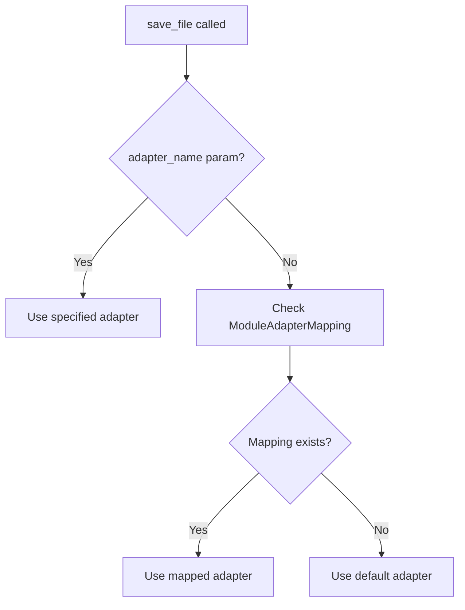
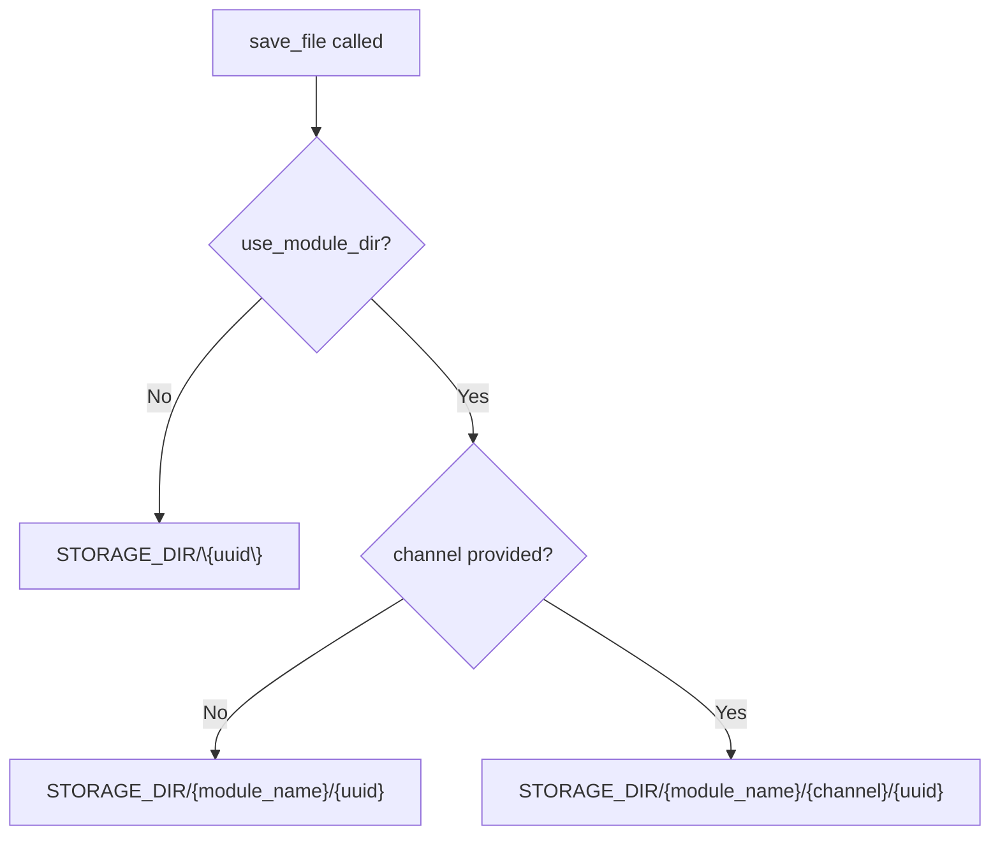

# ChaccFileManager Module

A ChaCC plugin module providing secure, UUID-addressed file management with adapter-based storage.

## Architecture


## Design Choices

### UUID-Based Storage
- **Files are stored using their UUID as the filename** (in `storage_key`)
- Original `filename` stored separately for download display
- Path obfuscation - users never know actual file location

### Security Features
- Path traversal protection via `_get_storage_path()` validation
- Files stored in configured `STORAGE_DIR` with resolved paths
- No filesystem path exposure in API responses

### Module Directory Organization
- `use_module_dir` flag in ModuleAdapterMapping controls module subdirectory
- If enabled: files stored in `STORAGE_DIR/{module_name}/...`
- If disabled: files stored flat in `STORAGE_DIR/...`

### Channel as Subdirectory
- `channel` is an optional subdirectory **inside module directory**
- Only used when `use_module_dir=true`
- If `use_module_dir=false`, channel is ignored

### Streaming Performance
- Async file streaming using `aiofiles`
- Range request support (206 Partial Content)
- Streams prevent loading entire files into memory

### Headers for HTML/Media
- `Content-Disposition: inline` by default (for ``, `<video>` tags)
- `Cache-Control: public, max-age=31536000, immutable`
- ETag based on SHA-256 checksum

## API Endpoints

### File Operations

| Endpoint | Method | Description |
|----------|--------|-------------|
| `/files/` | POST | Upload a file (multipart form with `file` field) |
| `/files/{uuid}/content` | GET | Serve file content by UUID |
| `/files/{uuid}/content?download=1` | GET | Download with attachment disposition |
| `/files/{uuid}` | DELETE | Delete a file by UUID |

### Metadata Endpoints

| Endpoint | Method | Description |
|----------|--------|-------------|
| `/files/adapters` | GET | List all registered adapters |
| `/files/adapters/{name}` | GET | Get adapter info |
| `/files/module-mappings` | GET | List module-to-adapter mappings |
| `/files/module-mappings` | POST | Create module-to-adapter mapping |
| `/files/module-mappings/{module_name}` | DELETE | Delete module-to-adapter mapping |

## Adapter Resolution

Modules specify only `created_by_module`:

```python
# Module code
service = FileService()
record = await service.save_file(
    file_content=data,
    filename="photo.jpg",
    content_type="image/jpeg",
    created_by_module="menu",  # Module identifies itself
)
```

The service resolves adapter priority:



## Module-to-Adapter Mapping

Map modules to adapters at runtime (admin operation):

```bash
# POST /files/module-mappings
{"module_name": "menu", "adapter_name": "local", "use_module_dir": true}
{"module_name": "orders", "adapter_name": "s3", "use_module_dir": false}
```

Modules don't call this - administrators configure it. Modules only use their identifier.

## Directory Storage Logic



Examples:
- `use_module_dir=false` → `STORAGE_DIR/uuid`
- `use_module_dir=true, channel=""` → `STORAGE_DIR/menu/uuid`
- `use_module_dir=true, channel="images"` → `STORAGE_DIR/menu/images/uuid`

## Configuration

```bash
# .env
CHACC_FILE_MANAGER_STORAGE_DIR=/var/lib/app/uploads
CHACC_FILE_MANAGER_MAX_FILE_SIZE=52428800
```

| Variable | Default | Description |
|----------|---------|-------------|
| `STORAGE_DIR` | `/tmp/chacc_file_storage` | Base directory |
| `MAX_FILE_SIZE` | `10485760` | Max bytes (10MB) |

## Extending the File Manager

This module handles file uploads, storage, and serving out of the box. By default, files are stored on the local filesystem. If you need files to live somewhere else — Google Drive, S3, a database, or anywhere else — you can extend it with a custom adapter. No changes to this module are required.

### What This Module Provides

- **File upload and download** via a simple service interface
- **UUID-based file addressing** — files are referenced by a stable UUID, not by path
- **Local filesystem storage** as the default adapter
- **Module-to-adapter routing** — different modules can use different storage backends
- **Streaming with range requests** — works for images, videos, and large files

### How Other Modules Use It

Any ChaCC module can save, retrieve, and delete files by obtaining the file service from the backbone context:

```python
from .context_factory import get_module_context

file_service = get_module_context().get_service("file_service")

# Save a file
record = await file_service.save_file(
    file_content=data,
    filename="photo.jpg",
    content_type="image/jpeg",
    created_by_module="menu",  # Your module name
)

# Get a download URL
url = await file_service.get_download_url(
    file_uuid=record.uuid,
    request=request,
    db_session=db,
)
```

That's it. The module does not need to know where files are stored, which adapter is used, or how paths are resolved.

### What You Can Do as an Extension

As a module author, you can:

1. **Register a new adapter** so files can be stored in your backend of choice
2. **Map a module to your adapter** so all files from that module use your backend
3. **Let the file manager handle routing** — it will automatically use your adapter when appropriate

### The Adapter Contract

An adapter is any object that implements the following methods. It does not need to inherit from a specific class — it just needs to match this interface:

| Method | Purpose | Returns |
|--------|---------|---------|
| `save(file_uuid, content, content_type)` | Store file bytes | `str` — the storage key (usually just `file_uuid`) |
| `delete(storage_key)` | Remove a stored file | `bool` — `True` if successful |
| `exists(storage_key)` | Check if a file exists | `bool` |
| `get_size(storage_key)` | Get file size in bytes | `int` |
| `get_url(storage_key, request)` | Generate a URL for accessing the file | `str` |
| `read_stream(storage_key, start, end)` | Stream file bytes, optionally bounded by byte range | Async iterator of `bytes` chunks |
| `health_check()` | Verify the adapter is operational | `bool` |

**Rules of the contract:**
- `file_uuid` and `storage_key` are opaque strings assigned by the file manager. Treat them as identifiers, not filesystem paths.
- `read_stream` must support `start` and `end` parameters for range requests. If `end` is `None`, stream to the end of the file.
- If your backend does not support streaming, read the full content in memory and yield it in chunks. The file manager will handle it correctly.
- `get_url` should return a URL the client can use to access the file. For external backends, this can be a presigned URL or a proxy endpoint.

**Development stub**

For IDE autocomplete and type checking during development, copy this class into your module. It is not imported from the file manager — it is a local development aid only. At runtime, the actual base class is fetched from the backbone context and your adapter is validated against it during registration.

```python
# In your module — for development only
class BaseAdapter:
    name: str = "base"

    async def save(self, file_uuid: str, content: bytes, content_type: str) -> str:
        raise NotImplementedError

    async def delete(self, storage_key: str) -> bool:
        raise NotImplementedError

    async def exists(self, storage_key: str) -> bool:
        raise NotImplementedError

    async def get_size(self, storage_key: str) -> int:
        raise NotImplementedError

    async def get_url(self, storage_key: str, request) -> str:
        raise NotImplementedError

    async def read_stream(self, storage_key: str, start: int = 0, end: int | None = None):
        raise NotImplementedError

    async def health_check(self) -> bool:
        return True
```

Use it like this:

```python
class GDriveAdapter(BaseAdapter):
    name = "gdrive"

    async def save(self, file_uuid, content, content_type):
        # Your implementation
        ...
```

At registration time, your adapter is validated against the adapter contract. If a method is missing or has the wrong signature, registration fails with a clear error.

**Using the context-provided `BaseAdapter`**

The file manager exposes the actual `BaseAdapter` class through the backbone context under the service name `"base_adapter"`. This is not an instance — it is the **class type itself**. You can fetch it and cast it to your local stub so the IDE treats your adapter as a proper subclass:

```python
from .base_adapter_stub import BaseAdapter
from typing import cast

_base_adapter_class = get_module_context().get_service("base_adapter")
BaseAdapter = cast(type[BaseAdapter], _base_adapter_class)

class GDriveAdapter(BaseAdapter):
    name = "gdrive"
    ...
```

If you do not need IDE support, you can skip the local stub and cast entirely. Registration will still validate your adapter structurally.

### Step-by-Step: Adding a GDrive Adapter

Here is a complete example of how another module would add Google Drive support.

**Step 1 — Create your adapter class**

This lives inside your own module. For IDE support during development, copy the `BaseAdapter` stub from the contract section above into your module. Your adapter inherits from it. You do not import anything from the file manager.

```python
# gdrive_module/src/gdrive_adapter.py
from .base_adapter_stub import BaseAdapter

class GDriveAdapter(BaseAdapter):
    name = "gdrive"

    def __init__(self, credentials_path, folder_id):
        self.credentials_path = credentials_path
        self.folder_id = folder_id
        # Initialize your Drive client here

    async def save(self, file_uuid, content, content_type):
        # Upload bytes to Google Drive
        # Return file_uuid as storage_key (or map to a Drive ID internally)
        drive_file = await self._upload(content, file_uuid)
        return file_uuid

    async def delete(self, storage_key):
        # Delete from Google Drive
        return True

    async def exists(self, storage_key):
        # Check if file exists in Drive
        return True

    async def get_size(self, storage_key):
        # Return file size from Drive metadata
        return 0

    async def get_url(self, storage_key, request):
        # Return a shareable or proxy URL
        return f"https://drive.google.com/file/{storage_key}"

    async def read_stream(self, storage_key, start=0, end=None):
        # Stream bytes from Drive API in chunks
        chunk_size = 8192
        # ... yield chunks ...
        yield b""

    async def health_check(self):
        return True
```

**Step 2 — Register your adapter at module startup**

In your module's `setup_plugin()`, obtain the registration hook from the backbone context and register your adapter:

```python
# gdrive_module/src/main.py
from .context_factory import get_context, set_module_context
from .gdrive_adapter import GDriveAdapter

def setup_plugin(context=None):
    ctx = get_context(context)
    set_module_context(ctx)

    adapter = GDriveAdapter(
        credentials_path="/etc/secrets/gdrive.json",
        folder_id="abc123",
    )

    register_file_adapter = ctx.get_service("register_file_adapter")
    register_file_adapter(adapter, name="gdrive", description="Google Drive storage")

    return gdrive_router
```

That's all that is needed to make your adapter available to the file manager.

**Step 3 — Map a module to your adapter**

Once your adapter is registered, an administrator can map any module to it:

```bash
POST /files/module-mappings
{
  "module_name": "menu",
  "adapter_name": "gdrive",
  "use_module_dir": true
}
```

After this, every file uploaded by the `menu` module with `created_by_module="menu"` will be stored in Google Drive instead of the local filesystem.

### How Files Are Organized

The file manager builds a `storage_key` for each file. This key is passed to your adapter's methods. The pattern is:

- **Flat**: `storage_key = "<uuid>"`
- **With module directory**: `storage_key = "<module_name>/<uuid>"`
- **With module and channel**: `storage_key = "<module_name>/<channel>/<uuid>"`

This structure is controlled by the `use_module_dir` flag in the module mapping. Your adapter receives the full key and can use it however it wants — as a folder path, a metadata prefix, or ignore it entirely.

### What You Should Not Do

- Do not import `BaseAdapter`, `AdapterRegistry`, or any internal class directly from this module's source
- Do not modify this module's code to support your backend
- Do not store absolute filesystem paths in your adapter — the file manager handles path resolution
- Do not override the default adapter (`local`). The local adapter is always the fallback.

### Troubleshooting

**My adapter is not being used:**
- Verify the module mapping exists: `GET /files/module-mappings`
- Verify your adapter is registered: `GET /files/adapters`
- Check that `adapter_name` in the mapping exactly matches the name you used during registration

**Files are uploaded but not found:**
- Ensure your `read_stream` and `exists` methods use the same `storage_key` logic as `save`
- Ensure `get_size` returns the correct size in bytes

**Range requests fail:**
- Your `read_stream` must honor the `start` and `end` parameters
- If your backend does not support byte ranges, read the full file and slice it in memory

## Testing

```bash
pytest src/tests/ -v
```