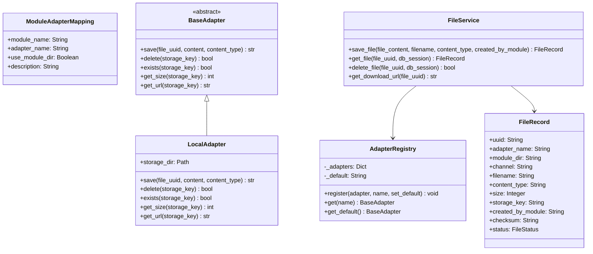
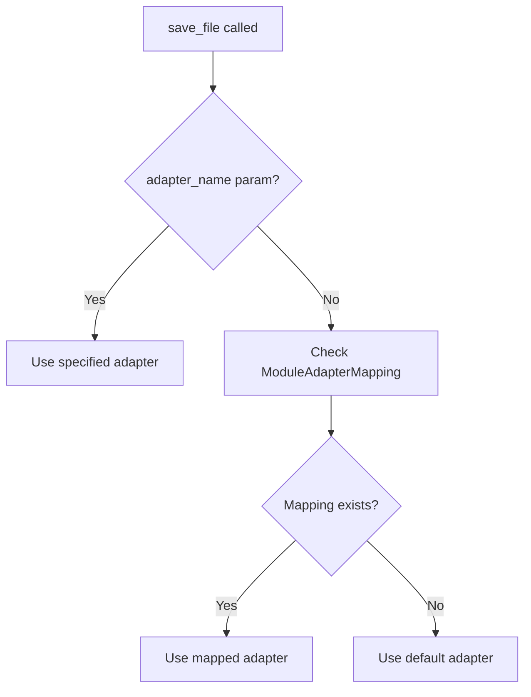

# ChaccFileManager Module

A ChaCC plugin module providing secure, UUID-addressed file management with adapter-based storage.

## Architecture



## Design Choices

### UUID-Based Storage
- **Files are stored using their UUID as the filename** (in `storage_key`)
- Original `filename` stored separately for download display
- Path obfuscation - users never know actual file location

### Security Features
- Path traversal protection via `_get_storage_path()` validation
- Files stored in configured `STORAGE_DIR` with resolved paths
- No filesystem path exposure in API responses

### Module Directory Organization
- `use_module_dir` flag in ModuleAdapterMapping controls module subdirectory
- If enabled: files stored in `STORAGE_DIR/{module_name}/...`
- If disabled: files stored flat in `STORAGE_DIR/...`

### Channel as Subdirectory
- `channel` is an optional subdirectory **inside module directory**
- Only used when `use_module_dir=true`
- If `use_module_dir=false`, channel is ignored

### Streaming Performance
- Async file streaming using `aiofiles`
- Range request support (206 Partial Content)
- Streams prevent loading entire files into memory

### Headers for HTML/Media
- `Content-Disposition: inline` by default (for ``, `<video>` tags)
- `Cache-Control: public, max-age=31536000, immutable`
- ETag based on SHA-256 checksum

## API Endpoints

### File Operations

| Endpoint | Method | Description |
|----------|--------|-------------|
| `/files/` | POST | Upload a file (multipart form with `file` field) |
| `/files/{uuid}/content` | GET | Serve file content by UUID |
| `/files/{uuid}/content?download=1` | GET | Download with attachment disposition |
| `/files/{uuid}` | DELETE | Delete a file by UUID |

### Metadata Endpoints

| Endpoint | Method | Description |
|----------|--------|-------------|
| `/files/adapters` | GET | List all registered adapters |
| `/files/adapters/{name}` | GET | Get adapter info |
| `/files/module-mappings` | GET | List module-to-adapter mappings |
| `/files/module-mappings` | POST | Create module-to-adapter mapping |
| `/files/module-mappings/{module_name}` | DELETE | Delete module-to-adapter mapping |

## Adapter Resolution

Modules specify only `created_by_module`:

```python
# Module code
service = FileService()
record = await service.save_file(
    file_content=data,
    filename="photo.jpg",
    content_type="image/jpeg",
    created_by_module="menu",  # Module identifies itself
)
```

The service resolves adapter priority:



## Module-to-Adapter Mapping

Map modules to adapters at runtime (admin operation):

```bash
# POST /files/module-mappings
{"module_name": "menu", "adapter_name": "local", "use_module_dir": true}
{"module_name": "orders", "adapter_name": "s3", "use_module_dir": false}
```

Modules don't call this - administrators configure it. Modules only use their identifier.

## Directory Storage Logic

```mermaid
flowchart TD
    A[save_file called] --> B{use_module_dir?}
    B -->|No| C[STORAGE_DIR/{uuid}]
    B -->|Yes| D{channel provided?}
    D -->|No| E[STORAGE_DIR/{module_name}/{uuid}]
    D -->|Yes| F[STORAGE_DIR/{module_name}/{channel}/{uuid}]
```

Examples:
- `use_module_dir=false` → `STORAGE_DIR/uuid`
- `use_module_dir=true, channel=""` → `STORAGE_DIR/menu/uuid`
- `use_module_dir=true, channel="images"` → `STORAGE_DIR/menu/images/uuid`

## Configuration

```bash
# .env
CHACC_FILE_MANAGER_STORAGE_DIR=/var/lib/app/uploads
CHACC_FILE_MANAGER_MAX_FILE_SIZE=52428800
```

| Variable | Default | Description |
|----------|---------|-------------|
| `STORAGE_DIR` | `/tmp/chacc_file_storage` | Base directory |
| `MAX_FILE_SIZE` | `10485760` | Max bytes (10MB) |

## Creating Custom Adapters

```python
# adapters/s3.py
from adapters.base import BaseAdapter

class S3Adapter(BaseAdapter):
    name = "s3"

    async def save(self, file_uuid: str, content: bytes, content_type: str) -> str:
        # Upload to S3
        return f"s3://bucket/{file_uuid}"

    async def delete(self, storage_key: str) -> bool:
        # Delete from S3
        return True
```

Register in `main.py`:

```python
s3_adapter = S3Adapter(bucket="my-bucket")
AdapterRegistry.register(s3_adapter, name="s3")
```

## Testing

```bash
pytest src/tests/ -v
```